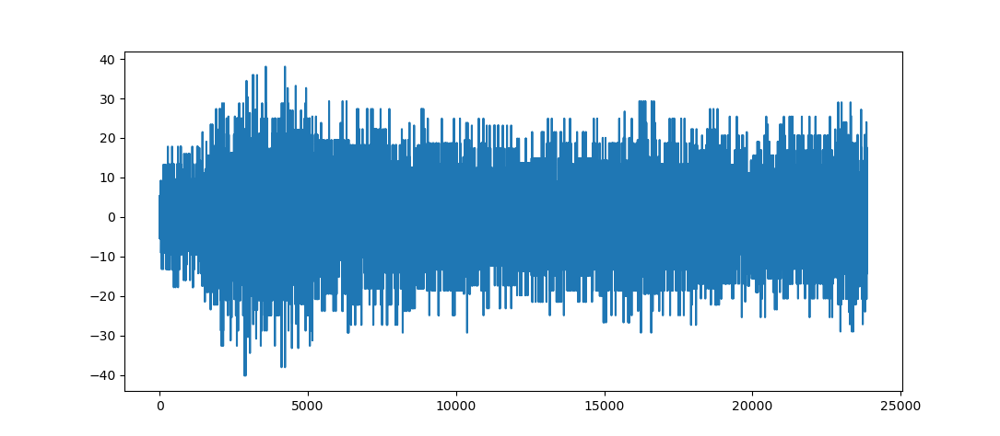

# sentinel1_decode (W.I.P.)

This is a C++ program/library for decoding Level-0 Raw data from the Sentinel-1 satellite. Currently, with OpenMP, sentinel1_decode can decode the complex samples for all packets in a data file in approximately 30 seconds on my Ryzen 5800.

For additional information on Level-0 product decoding, see the [SAR Space Packet Protocol Data Unit Specification](https://sentinels.copernicus.eu/documents/247904/2142675/Sentinel-1-SAR-Space-Packet-Protocol-Data-Unit.pdf) and the [Sentinel-1 Level-0 Data Decoding Package](https://sentinel.esa.int/documents/247904/0/Sentinel-1-Level-0-Data-Decoding-Package.pdf/a8742c59-4914-40c4-8309-c77515649f17).

*This code has been moved from my previous repo [sar_processing](https://github.com/andrewplayer3/sar_processing). That repo also contains a Python implementation of level-0 decoding that can be interacted with in Jupyter; although, it is much slower than this version.*

## Usage

### Compiling

Currently, there are two basic CLI utilities that can be built using `build.sh`.
 * bin/main provides cli commands for testing and evaulating the packet decoding.
 * bin/plot provides cli commands for plotting complex samples.

Both of these CLI's currently exist for my testing purposes and functionality will be changing regularly. You may need to edit this with your include paths and/or preferred compiler.

### Commands

The sample data is the VV file from this product: S1A_IW_RAW__0SDV_20240806T135224_20240806T135256_055093_06B68A_AE41

#### bin/main

```bash
# Print the primary and secondary headers
$ bin/main print_headers [packet_index] [path/to/data.dat]
```
```bash
$ bin/main print_headers 0 sample_data/sample.dat
packet_version_number: 0
packet_type: 0
secondary_header_flag: 1
process_id: 65
process_category: 12
sequence_flags: 3
packet_sequence_count: 11157
packet_data_length: 18621
coarse_time: 1406987562
fine_time: 7757
sync_marker: 892270675
data_take_id: 225252800
ecc_number: 8
test_mode: 0
rx_channel_id: 0
instrument_configuration_id: 7
sc_data_word_index: 27
sc_data_word: 48835
space_packet_count: 240533
pri_count: 243384
error_flag: 0
baq_mode: 12
baq_block_length: 31
range_decimation: 8
rx_gain: 8
tx_ramp_rate_sign: 1
tx_ramp_rate_mag: 1605
pulse_start_frequency_sign: 0
pulse_start_frequency_mag: 12335
pulse_length: 1967
rank: 9
pri: 21859
swst: 3681
swl: 13979
ssb_flag: 0
polarisation: 7
temperature_compensation: 3
elevation_beam_address: 6
azimuth_beam_address: 385
calibration_mode: 0
tx_pulse_number: 6
signal_type: 0
swap: 1
swath_number: 10
num_quadratures: 11938
```

```bash
# Print the operating mode information
$ bin/main print_modes [packet_index] [path/to/data.dat]
```
```bash
$ bin/main print_modes 0 sample_data/sample.dat
Data Format: D
BAQ Mode: fdbaq_mode_0
BAQ Block Length: 256
Test Mode: measurement_mode
Sensor Mode: interferomatric_wide_swath
Signal Type: echo
Error Status: nominal
```

```bash
# Print the pulse descriptors
$ bin/main print_pulse_info [packet_index] [path/to/data.dat]
```
```bash
$ bin/main print_pulse_info 0 sample_data/sample.dat
RX Polarization: V
TX Polarization: V
Pulse Length: 52.4048
TX Ramp Rate (TXPRR): 1.07823
Start Frequency (TXPSF): -28.2515
PRI: 582.367
SWL: 372.428
SWST: 98.0692
RX Gain: -4
Range Decimation: 8
TX Pulse Number: 6

```
```bash
# Print the complex samples
$ bin/main print_complex_samples [packet_index] [path/to/data.dat]
```
```bash
$ bin/main print_complex_samples 0 sample_data/sample.dat
# 50,000 lines later...
...
(-11.201,1.59988)
(1.59988,8.00034)
(-4.80058,-11.201)
(-4.80058,20.8031)
(4.80058,4.80058)
(17.6024,17.6024)
(4.80058,31.7194)
(-14.4017,8.00034)
(-11.201,20.8031)
(-4.80058,1.59988)
(1.59988,-4.80058)
(-8.00034,-4.80058)
(-4.80058,-14.4017)
(1.59988,11.201)
(1.59988,-4.80058)
```
```bash
# Performance test for decoding the complex data for all the packets
$ bin/main omp_test [path/to/sample.dat]
```
```bash
$ bin/main omp_test sample_data/sample.dat
Decoded 51937 packets in 32.0043s.
```
#### bin/plot
```bash
# Plot the real part of a packet's complex samples
$ bin/plot plot_complex_samples [packet_index] [path/to/sample.dat]
```
```
$ bin/plot plot_complex_samples 0 sample_data/sample.dat
```


## Requirements

The library code does not have any external requirements.

For the plotting CLI, matplotlib-cpp is required; it is included in the include directory. It does also require an installation of Python and NumPy. You can edit the build.sh file to set the include directories that point to Python and NumPY's include paths. In my case, they are in my miniforge3 environment.

For the main CLI, OpenMP is currently used but only for testing purposes.