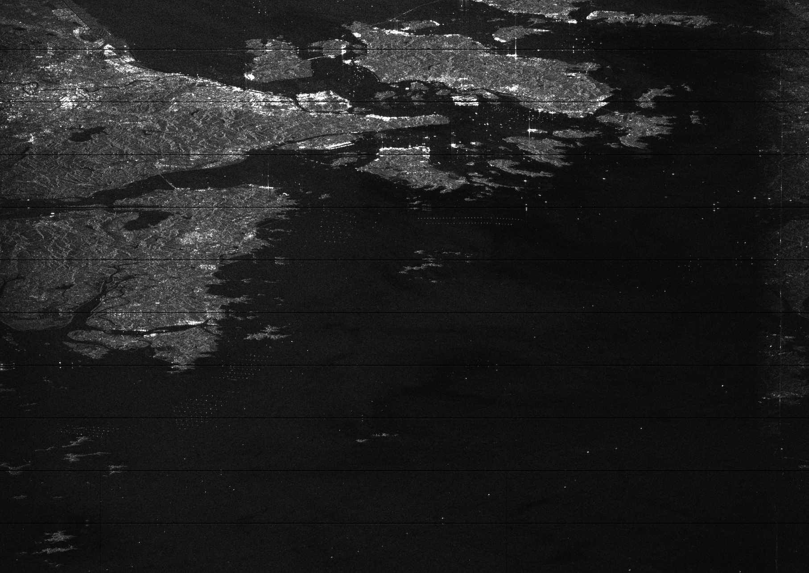

# sentinel1_decode
For additional information on Level-0 product decoding, see the [SAR Space Packet Protocol Data Unit Specification](https://sentinels.copernicus.eu/documents/247904/2142675/Sentinel-1-SAR-Space-Packet-Protocol-Data-Unit.pdf) and the [Sentinel-1 Level-0 Data Decoding Package](https://sentinel.esa.int/documents/247904/0/Sentinel-1-Level-0-Data-Decoding-Package.pdf/a8742c59-4914-40c4-8309-c77515649f17).

## Table of Contents

* [Introduction](#introduction)
* [Commands and Examples](#commands)
  * [Image Formation](#image-formation-and-saving-images)
  * [Packet Information and Performance Testing](#packet-information)
* [Results with Point Targets](#results-with-point-targets)
* [Compiling](#compiling)
   * [Build Script](#build-script)
   * [Dependencies](#dependencies)

## Introduction
**sentinel1_decode** is a C++ program/library for quickly decoding Level-0 Raw data from the Sentinel-1 satellite, and forming Level-1 SLC images. Currently, image formation for stripmap, IW swaths, and IW bursts mostly works for visual analysis, but won't have accurate phase and may contain some ambiguities. I am creating this as an education experience for myself, and because there isn't a good fast, simple, and robust program for decoding this data in a way that allows you to get the intermediate products and signals.

On my PC (Ryzen 9900x and 64GB DDR5 RAM), azimuth compressing a full stripmap image takes around 1 minute, and uses ~52GB of RAM. Azimuth compressing an IW mode swath takes approximately 2 minutes, and uses ~27GB of RAM. A burst takes about 30 seconds and uses ~20GB of RAM. Memory usage will go down as I move from `double` to `float` where possible. Decoding the raw data for a swath takes only a couple seconds.

Check out these other projects which were very helpful:</br>
[Rich Hall's sentinel1decoder (Python)](https://github.com/Rich-Hall/sentinel1decoder)</br>
[Rich Hall's sentinel1Level0DecodingDemo (Python/Jupyter)](https://github.com/Rich-Hall/sentinel1decoder)</br>
[jmfriedt's sentinel1_level0 (Matlab)](https://github.com/jmfriedt/sentinel1_level0)</br>

## Commands
### Image Formation and Saving Images
```bash
$ bin/s1_write --help
burst [swath] [burst_num] [in_path] [out_path]
swath [swath] [in_path] [out_path]
range_compressed_burst [swath] [burst_num] [in_path] [out_path]
range_compressed_swath [swath] [in_path] [out_path]
range_doppler_burst [swath] [burst_num] [in_path] [out_path]
range_doppler_swath [swath] [in_path] [out_path]
azimuth_compressed_burst [swath] [burst_num] [in_path] [out_path]
azimuth_compressed_swath [swath] [in_path] [out_path]
save_swath_as_cf32 [swath] [in_path] [out_path]
Scaling Options: [--norm_log|--norm|--mag|--real|--imag]
```
#### Image Formation Examples
The sample image *data/points/point.dat* is the VV data from [S1A_IW_RAW__0SDV_20240813T095440_20240813T095513_055193_06BA22_1119-RAW](https://search.asf.alaska.edu/#/?searchType=List%20Search&searchList=S1A_IW_RAW__0SDV_20240813T095440_20240813T095513_055193_06BA22_1119-RAW&resultsLoaded=true&granule=S1A_IW_RAW__0SDV_20240813T095440_20240813T095513_055193_06BA22_1119-RAW).

```bash
$ bin/s1_write swath IW2 data/points/point.dat IW2.tif --norm
```


```bash
$ bin/s1_write range_compressed_swath IW2 data/points/point.dat RC_IW2.tif --norm
```


```bash
$ bin/s1_write azimuth_compressed_swath IW2 data/points/point.dat AZ_IW2.tif --norm
```


```bash
$ bin/s1_write azimuth_compressed_swath S1 data/sm_sample/sample.dat AZ_S1.tif --norm
```


#### Packet Information

```bash
$ bin/s1_print --help
packet_info [packet_index] [path]
complex_samples [packet_index] [path]
swath_names [path]
index_records [path]
annotation_record [record_index] [path]
state_vectors [path]
```

#### Examples

The sample image *data/sample/sample.dat* is the VV data from [S1A_IW_RAW__0SDV_20240806T135224_20240806T135256_055093_06B68A_AE41](https://search.asf.alaska.edu/#/?searchType=List%20Search&searchList=S1A_IW_RAW__0SDV_20240806T135224_20240806T135256_055093_06B68A_AE41&resultsLoaded=true&granule=S1A_IW_RAW__0SDV_20240806T135224_20240806T135256_055093_06B68A_AE41-RAW)
```bash
$ bin/s1_print print_packet_info 0 data/sample/sample.dat
Primary Header:
packet_version_number: 0
packet_type: 0
secondary_header_flag: 1
process_id: 65
process_category: 12
sequence_flags: 3
packet_sequence_count: 11157
packet_data_length: 18621

Secondary Header:
coarse_time: 1406987562
fine_time: 7757
sync_marker: 892270675
data_take_id: 225252800
ecc_number: 8
test_mode: 0
rx_channel_id: 0
instrument_configuration_id: 7
sc_data_word_index: 27
sc_data_word: 48835
space_packet_count: 240533
pri_count: 243384
error_flag: 0
baq_mode: 12
baq_block_length: 31
range_decimation: 8
rx_gain: 8
tx_ramp_rate_sign: 1
tx_ramp_rate_mag: 1605
pulse_start_frequency_sign: 0
pulse_start_frequency_mag: 12335
pulse_length: 1967
rank: 9
pri: 21859
swst: 3681
swl: 13979
ssb_flag: 0
polarisation: 7
temperature_compensation: 3
elevation_beam_address: 6
azimuth_beam_address: 385
calibration_mode: 0
tx_pulse_number: 6
signal_type: 0
swap: 1
swath_number: 10
num_quadratures: 11938

Operating Mode Info:
Data Format: D
BAQ Mode: fdbaq_mode_0
BAQ Block Length: 256
Test Mode: measurement_mode
Sensor Mode: interferomatric_wide_swath
Signal Type: echo
Error Status: nominal

Pulse Info:
Swath: IW1
RX Polarization: V
TX Polarization: V
Pulse Length: 52.4048
TX Ramp Rate (TXPRR): 1.07823
Start Frequency (TXPSF): -28.2515
PRI: 582.367
SWL: 372.428
SWST: 98.0692
RX Gain: -4
Range Decimation: 8
TX Pulse Number: 6
```

```bash
$ bin/s1_print swath_names data/sm_sample/sample.dat
S1_100MHz_TXCAL: 80
S1_TXCAL: 250
S1_100MHz_CAL: 20
S1: 60701
```

```bash
$ bin/s1_print state_vectors data/sample/sample.dat
```


```bash
$ bin/s1_print print_complex_samples 0 data/sample/sample.dat
# 50,000 lines later...
...
(-11.201,1.59988)
(1.59988,8.00034)
(-4.80058,-11.201)
(-4.80058,20.8031)
(4.80058,4.80058)
(17.6024,17.6024)
(4.80058,31.7194)
(-14.4017,8.00034)
(-11.201,20.8031)
(-4.80058,1.59988)
(1.59988,-4.80058)
(-8.00034,-4.80058)
(-4.80058,-14.4017)
(1.59988,11.201)
(1.59988,-4.80058)
```

## Compiling

For now `cmake` is used. Although, I will likely switch to a Conda based install/compilation for simplicity later. 

Once the [dependencies](#dependencies) are installed, simply run:
```bash
cd build
cmake ..
cmake --build .
```

### Dependencies

My goal is to not involve too many external dependancies; however, some are necessary. *[OpenMP](https://curc.readthedocs.io/en/latest/programming/OpenMP-C.html)* and *[FFTW3](https://www.fftw.org/)* are required. The image writing is done via *[libtiff](http://www.libtiff.org/)*.
